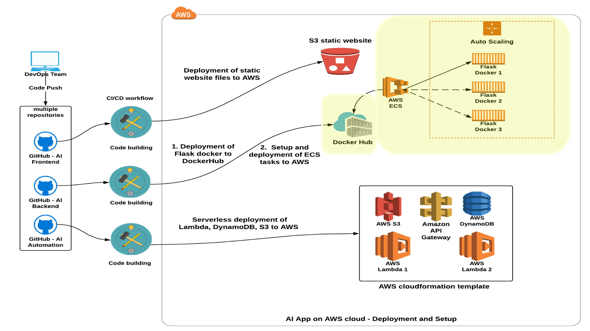

# Udacity Bertelsmann Technical Scholarship Cloud Track Challenge Project - Deploy An AI Sentiment Prediction App to AWS Cloud
 ---
#### _The project was created by 3 scholars from the Cloud Track Challenge_

* [Adrik S](https://github.com/Adriks976) (France)
* [Audrey ST](https://github.com/atan4583) (Australia)
* [Christopher R](https://github.com/christopherrauh) (Germany)

### Repo Information

> * this repo contains the code files for building and pushing a Flask docker image to Docker Hub, then deploying a new task definition to ECS for starting container operation on AWS
>
> * any changes pushed to the master branch will trigger the Github CI/CD Action on the repo to reubuild and deploy the changes to AWS

### CI/CD Action
> * triggered on push to master branch
>
> * workflow file: .github/workflows/aws.yml
>
> * mandatory enviroment variables
>     - **DOCKERHUB_PASS**: Dockerhub password of **_Adrik S_**
>
>     - **AWS_SECRET_ACCESS_KEY**: secret-access-key of iam user **_sc-backend_**
>
>     - **AWS_SECRET_ACCESS_KEY**: secret-access-key of iam user **_sc-backend_**
>
> * starts Flask docker build and push to Docker Hub, then deploys ECS task definition to AWS to start container operation
>
